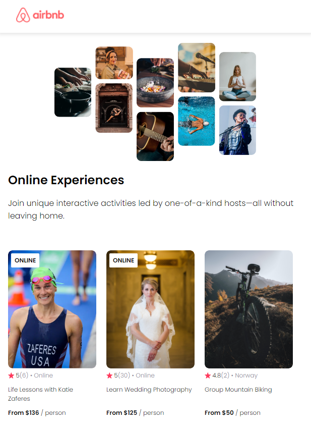

# Airbnb Experience Clone

A simple React project with one page cloning Airbnb Experience. Learning basic concepts in React.

## Concepts in React Development

- **JSX (JavaScript XML)**: JSX allows us to write HTML elements in JavaScript and place them in the DOM.
- **JavaScript in JSX**: Curly braces `{}` are used in JSX to embed JavaScript expressions.
- **ReactDOM.Render**: In React applications, this method is used to render JSX components to the DOM. 
- **Props**: They make it possible to pass data from parent to child components, helping to write more composable and reusable code.
- **Mapping Data**: React encourages the use of the `map()` method to transform arrays of data into arrays of elements/components.

## Installation & Setup with Vite

- **About Vite**: [Vite](https://vitejs.dev/) is a modern frontend build tool that provides fast server start, overall faster builds on React, thanks to its use of native ES modules in the development.

1. **Creating the project**:
   ```sh
   npm create vite@latest
   ```

2. **Navigating to your project folder**:
   ```sh
   cd my-react-app
   ```

3. **Installing dependencies**:
   ```sh
   npm install
   ```

4. **Starting the development server**:
   ```sh
   npm run dev
   ```


## Usage
